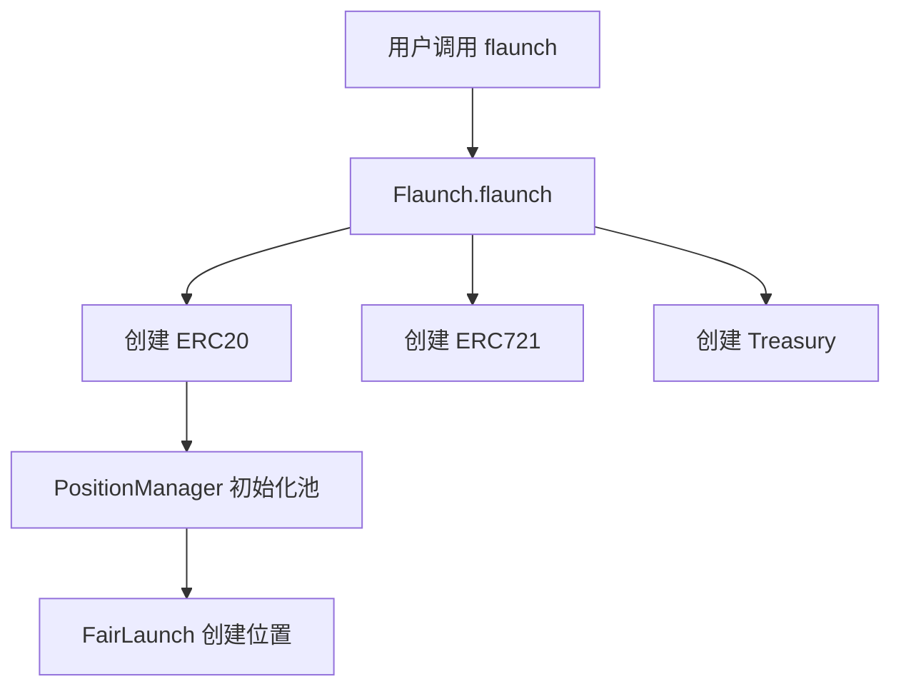

# ƒlaunch Protocol 学习指引文档

## 📚 目录

1. [项目概述](#项目概述)
2. [技术栈与依赖](#技术栈与依赖)
3. [核心概念](#核心概念)
4. [项目架构](#项目架构)
5. [核心模块详解](#核心模块详解)
6. [学习路径](#学习路径)
7. [实践建议](#实践建议)
8. [参考资料](#参考资料)

---

## 项目概述

### 什么是 ƒlaunch Protocol？

ƒlaunch 是一个基于 **Uniswap V4** 的 meme 币公平启动平台，旨在创建一个可持续的"meme 经济"生态系统。与传统启动平台不同，ƒlaunch 通过创新的机制确保公平、透明和低风险的启动环境。

### 核心价值主张

1. **公平启动**：所有参与者享有平等的启动机会
2. **开发者激励**：开发者通过交易手续费获得持续收益（Dev Revs）
3. **价格稳定**：通过 Progressive Bid Wall 机制稳定代币价格
4. **社区治理**：代币持有者可以控制资金库的使用

---

## 技术栈与依赖

### 核心技术

- **Solidity**: `^0.8.26`
- **Foundry**: 开发、测试和部署框架
- **Uniswap V4**: 作为底层 AMM 协议
- **Optimism Superchain**: 支持跨链桥接

### 主要依赖库

```
lib/
├── forge-std/              # Foundry 标准库
├── openzeppelin-contracts/ # OpenZeppelin 安全合约库
├── solady/                 # 优化的 Solidity 库
├── v4-core/                # Uniswap V4 核心
├── v4-periphery/           # Uniswap V4 外围合约
└── optimism/               # Optimism 相关合约
```

### 开发环境设置

```bash
# 1. 安装 Foundry
curl -L https://foundry.paradigm.xyz | bash
foundryup

# 2. 克隆项目
git clone https://github.com/flayerlabs/flaunchgg-contracts.git
cd flaunchgg-contracts

# 3. 安装依赖
forge install

# 4. 运行测试
forge test
```

---

## 核心概念

### 1. Fair Launch（公平启动）

**定义**：在代币创建后的特定时间窗口内，代币价格保持固定，所有购买者以相同价格购买。

**特点**：
- 单边流动性池（只有代币，没有 ETH）
- 在固定 tick 位置
- 期间内只能买入，不能卖出
- 结束后，ETH 收益和剩余代币转换为正常的 Uniswap 流动性池

**代码位置**：`src/contracts/hooks/FairLaunch.sol`

### 2. Bid Wall（出价墙）

**定义**：一个动态的买单墙，位于当前价格下方 1 个 tick，用于稳定价格。

**工作原理**：
- 使用交易手续费累积的 ETH
- 自动重新平衡以保持在当前价格下方
- 当价格下跌时提供流动性支持

**代码位置**：`src/contracts/bidwall/BidWall.sol`

### 3. Dev Revs（开发者收益）

**定义**：开发者从所有交易手续费中获得一定比例的收益。

**特点**：
- 自动转换为 flETH（ETH 等价代币）
- 通过 Internal Swap Pool 转换，避免代币抛售
- 激励开发者关注长期发展

### 4. Memecoin Treasury（代币资金库）

**定义**：代币持有者可以控制的资金库，用于社区治理和资金管理。

**功能**：
- 接收交易手续费
- 执行社区投票的操作
- 支持多种操作（回购、销毁、分配等）

**代码位置**：`src/contracts/treasury/MemecoinTreasury.sol`

### 5. Internal Swap Pool (ISP)

**定义**：内部交换池，在交易到达 Uniswap 之前处理部分交换。

**作用**：
- 减少对主池的影响
- 降低 gas 成本
- 作为部分订单簿功能

---

## 项目架构

### 整体架构图

```
┌─────────────────────────────────────────────────────────┐
│                    PositionManager                       │
│              (Uniswap V4 Hook - 核心控制器)                │
└─────────────────────────────────────────────────────────┘
                            │
        ┌───────────────────┼───────────────────┐
        │                   │                   │
        ▼                   ▼                   ▼
┌──────────────┐   ┌──────────────┐   ┌──────────────┐
│  FairLaunch  │   │   BidWall    │   │ FeeDistributor│
│  (公平启动)   │   │  (出价墙)     │   │  (费用分配)   │
└──────────────┘   └──────────────┘   └──────────────┘
        │                   │                   │
        └───────────────────┼───────────────────┘
                            │
        ┌───────────────────┼───────────────────┐
        │                   │                   │
        ▼                   ▼                   ▼
┌──────────────┐   ┌──────────────┐   ┌──────────────┐
│   Flaunch    │   │   Memecoin   │   │MemecoinTreasury│
│   (ERC721)   │   │   (ERC20)    │   │  (资金库)     │
└──────────────┘   └──────────────┘   └──────────────┘
```

### 数据流

#### 1. 代币启动流程

```
用户调用 PositionManager.flaunch()
    ↓
Flaunch.flaunch() 创建 ERC20 和 ERC721
    ↓
PositionManager 初始化 Uniswap V4 池
    ↓
FairLaunch.createPosition() 创建公平启动位置
    ↓
用户可以在公平启动期间购买代币
    ↓
公平启动结束后，转换为正常流动性池
```

#### 2. 交易流程

```
用户发起交换
    ↓
PositionManager.beforeSwap()
    ├─ FairLaunch.fillFromPosition() (如果在公平启动期间)
    ├─ InternalSwapPool._internalSwap() (内部交换)
    └─ BidWall.checkStalePosition() (检查出价墙)
    ↓
Uniswap V4 执行交换
    ↓
PositionManager.afterSwap()
    ├─ FeeDistributor._captureAndDepositFees() (捕获手续费)
    ├─ FeeDistributor._distributeFees() (分配手续费)
    └─ BidWall.deposit() (存入出价墙)
```

---

## 核心模块详解

### 模块 1: PositionManager

**文件位置**：`src/contracts/PositionManager.sol`

**职责**：
- 作为 Uniswap V4 Hook 的核心控制器
- 协调所有子模块的交互
- 处理代币启动、交换、流动性管理等

**关键函数**：

```solidity
// 启动新代币
function flaunch(FlaunchParams calldata _params) external payable returns (address memecoin_)

// Uniswap V4 Hook 函数
function beforeSwap(...) // 交换前处理
function afterSwap(...)  // 交换后处理
function beforeAddLiquidity(...) // 添加流动性前
function beforeRemoveLiquidity(...) // 移除流动性前
```

**学习重点**：
1. 理解 Uniswap V4 Hook 机制
2. 学习如何协调多个子模块
3. 理解 transient storage (tstore) 的使用

**建议学习顺序**：
1. 先阅读 `getHookPermissions()` 了解启用的 hook
2. 阅读 `flaunch()` 了解启动流程
3. 阅读 `beforeSwap()` 和 `afterSwap()` 了解交易处理

---

### 模块 2: Flaunch (ERC721)

**文件位置**：`src/contracts/Flaunch.sol`

**职责**：
- 创建和管理 ERC721 NFT（代表代币所有权）
- 部署 Memecoin (ERC20) 和 MemecoinTreasury
- 处理跨链桥接

**关键函数**：

```solidity
// 启动新代币
function flaunch(PositionManager.FlaunchParams calldata _params) 
    external returns (address memecoin_, address payable memecoinTreasury_, uint tokenId_)

// 跨链桥接
function initializeBridge(uint _tokenId, uint _chainId)
function finalizeBridge(uint _tokenId, MemecoinMetadata memory _metadata)
```

**学习重点**：
1. 理解 ERC721 作为所有权证明的机制
2. 学习确定性克隆（deterministic clone）的使用
3. 了解跨链桥接的实现

**建议学习顺序**：
1. 阅读构造函数和初始化函数
2. 阅读 `flaunch()` 了解代币创建流程
3. 阅读桥接相关函数（如果对跨链感兴趣）

---

### 模块 3: Memecoin (ERC20)

**文件位置**：`src/contracts/Memecoin.sol`

**职责**：
- 实现标准的 ERC20 代币
- 支持 ERC20Votes（投票功能）
- 支持 Permit2（无需授权的交换）
- 支持 Superchain 跨链

**关键特性**：

```solidity
// 继承多个标准
contract Memecoin is 
    ERC20PermitUpgradeable, 
    ERC20VotesUpgradeable, 
    IERC7802,  // Superchain 接口
    IMemecoin

// Permit2 无限授权
function allowance(address owner, address spender) 
    public view override returns (uint) {
    if (spender == _PERMIT2) return type(uint).max;
    return super.allowance(owner, spender);
}
```

**学习重点**：
1. 理解可升级合约模式
2. 学习 ERC20Votes 的投票机制
3. 了解 Permit2 集成

---

### 模块 4: FairLaunch

**文件位置**：`src/contracts/hooks/FairLaunch.sol`

**职责**：
- 管理公平启动期间的单边流动性
- 处理公平启动期间的购买
- 在公平启动结束后转换为正常流动性池

**关键函数**：

```solidity
// 创建公平启动位置
function createPosition(
    PoolId _poolId,
    int24 _initialTick,
    uint _flaunchesAt,
    uint _initialTokenFairLaunch,
    uint _fairLaunchDuration
) public returns (FairLaunchInfo memory)

// 从公平启动位置填充交换
function fillFromPosition(
    PoolKey calldata _key,
    int256 _amountSpecified,
    bool _nativeIsZero
) public returns (BeforeSwapDelta, BalanceDelta, FairLaunchInfo memory)

// 关闭公平启动位置
function closePosition(...) public
```

**学习重点**：
1. 理解单边流动性的实现
2. 学习如何在固定价格下处理交换
3. 了解流动性转换机制

**建议学习顺序**：
1. 阅读 `FairLaunchInfo` 结构体
2. 阅读 `createPosition()` 了解初始化
3. 阅读 `fillFromPosition()` 了解交换处理
4. 阅读 `closePosition()` 了解结束流程

---

### 模块 5: BidWall

**文件位置**：`src/contracts/bidwall/BidWall.sol`

**职责**：
- 创建和管理出价墙位置
- 自动重新平衡以保持在当前价格下方
- 处理出价墙的启用/禁用

**关键函数**：

```solidity
// 存入 ETH 到出价墙
function deposit(
    PoolKey memory _poolKey,
    uint _ethAmount,
    int24 _currentTick,
    bool _nativeIsZero
) public

// 重新定位出价墙
function reposition(
    PoolKey memory _poolKey,
    int24 _currentTick,
    bool _nativeIsZero
) public

// 检查并处理过时的位置
function checkStalePosition(...) public
```

**学习重点**：
1. 理解动态流动性管理
2. 学习如何计算 tick 范围
3. 了解价格保护机制

**建议学习顺序**：
1. 阅读 `PoolInfo` 结构体
2. 阅读 `deposit()` 了解存入机制
3. 阅读 `reposition()` 了解重新平衡
4. 阅读 `checkStalePosition()` 了解过时处理

---

### 模块 6: FeeDistributor

**文件位置**：`src/contracts/hooks/FeeDistributor.sol`（继承在 PositionManager 中）

**职责**：
- 捕获交易手续费
- 分配手续费给不同接收者（创建者、出价墙、协议、资金库）
- 管理费用计算器

**费用分配流程**：

```
交易手续费
    ↓
捕获手续费
    ↓
分配：
    ├─ 创建者费用 (Creator Fee)
    ├─ 出价墙费用 (BidWall Fee)
    ├─ 协议费用 (Protocol Fee)
    └─ 资金库费用 (Treasury Fee)
```

**关键函数**：

```solidity
// 捕获和存入手续费
function _captureAndDepositFees(...) internal returns (uint swapFee_)

// 分配手续费
function _distributeFees(PoolKey memory _poolKey) internal

// 计算费用分配
function feeSplit(PoolId _poolId, uint _amount) 
    public view returns (uint bidWallFee, uint creatorFee, uint protocolFee)
```

**学习重点**：
1. 理解费用捕获机制
2. 学习费用分配逻辑
3. 了解动态费用计算器

---

### 模块 7: MemecoinTreasury

**文件位置**：`src/contracts/treasury/MemecoinTreasury.sol`

**职责**：
- 管理代币的资金库
- 执行社区投票的操作
- 支持多种操作类型（回购、销毁、分配等）

**关键概念**：

- **TreasuryManager**: 管理资金库的合约
- **TreasuryAction**: 可执行的操作（回购、销毁等）
- **Permissions**: 权限控制（白名单、封闭等）

**学习重点**：
1. 理解资金库管理模式
2. 学习操作执行机制
3. 了解权限控制系统

---

### 模块 8: Fee Calculators（费用计算器）

**文件位置**：`src/contracts/fees/`

**类型**：

1. **StaticFeeCalculator**: 固定费率
2. **DynamicFeeCalculator**: 动态费率（基于交易量等）
3. **HypeFeeCalculator**: 基于热度的费率
4. **TrustedSignerFeeCalculator**: 基于可信签名的费率

**学习重点**：
1. 理解不同费率计算策略
2. 学习如何实现动态费率
3. 了解费率计算器的接口设计

---

## 学习路径

### 阶段 1: 基础理解（1-2 周）

**目标**：理解项目整体架构和核心概念

**任务**：

1. **阅读文档**
   - [ ] 阅读 README.md
   - [ ] 阅读本文档
   - [ ] 了解 Uniswap V4 基础知识

2. **理解核心概念**
   - [ ] 什么是 Fair Launch？
   - [ ] 什么是 Bid Wall？
   - [ ] 什么是 Dev Revs？

3. **探索代码结构**
   ```bash
   # 查看主要合约
   ls src/contracts/
   
   # 查看接口
   ls src/interfaces/
   
   # 查看测试
   ls test/
   ```

**推荐资源**：
- [Uniswap V4 文档](https://docs.uniswap.org/sdk/v4/overview)
- [Foundry 文档](https://book.getfoundry.sh/)

---

### 阶段 2: 核心模块学习（2-3 周）

**目标**：深入理解各个核心模块的实现

**任务**：

1. **PositionManager**
   - [ ] 阅读 `PositionManager.sol`
   - [ ] 理解 Hook 机制
   - [ ] 跟踪 `flaunch()` 函数执行流程
   - [ ] 理解 `beforeSwap()` 和 `afterSwap()` 逻辑

2. **Flaunch (ERC721)**
   - [ ] 阅读 `Flaunch.sol`
   - [ ] 理解代币创建流程
   - [ ] 学习确定性克隆（deterministic clone）

3. **FairLaunch**
   - [ ] 阅读 `FairLaunch.sol`
   - [ ] 理解单边流动性实现
   - [ ] 跟踪公平启动期间的交换流程

4. **BidWall**
   - [ ] 阅读 `BidWall.sol`
   - [ ] 理解出价墙机制
   - [ ] 学习重新平衡逻辑

**实践练习**：
- 在测试文件中添加注释
- 绘制函数调用流程图
- 编写简单的测试用例

---

### 阶段 3: 高级功能学习（2-3 周）

**目标**：理解高级功能和集成

**任务**：

1. **费用系统**
   - [ ] 阅读 `FeeDistributor` 相关代码
   - [ ] 理解不同费用计算器
   - [ ] 跟踪费用分配流程

2. **资金库系统**
   - [ ] 阅读 `MemecoinTreasury.sol`
   - [ ] 理解 TreasuryManager 系统
   - [ ] 学习操作执行机制

3. **跨链桥接**
   - [ ] 阅读桥接相关代码
   - [ ] 理解 Superchain 互操作性

4. **Zap 合约**
   - [ ] 阅读 `FlaunchZap.sol`
   - [ ] 理解便捷启动功能

**实践练习**：
- 分析一个完整的代币启动流程
- 跟踪一次交易的完整执行路径
- 理解费用如何在不同模块间流转

---

### 阶段 4: 测试和调试（1-2 周）

**目标**：通过测试理解系统行为

**任务**：

1. **运行测试**
   ```bash
   # 运行所有测试
   forge test
   
   # 运行特定测试
   forge test --match-path test/Flaunch.t.sol
   
   # 带详细输出
   forge test -vvv
   ```

2. **分析测试用例**
   - [ ] 阅读 `test/Flaunch.t.sol`
   - [ ] 阅读 `test/PositionManager.t.sol`
   - [ ] 理解测试场景和边界情况

3. **调试技巧**
   - [ ] 学习使用 `forge test --debug`
   - [ ] 使用 `console.log` 进行调试
   - [ ] 理解 revert 原因

**实践练习**：
- 编写新的测试用例
- 修复一个测试失败
- 添加边界情况测试

---

### 阶段 5: 深入研究和贡献（持续）

**目标**：成为项目专家

**任务**：

1. **代码审查**
   - [ ] 审查其他贡献者的 PR
   - [ ] 提出改进建议

2. **性能优化**
   - [ ] 分析 gas 使用
   - [ ] 提出优化方案

3. **安全审计**
   - [ ] 学习常见漏洞
   - [ ] 进行代码安全审查

4. **文档改进**
   - [ ] 改进代码注释
   - [ ] 编写使用示例

---

## 实践建议

### 1. 代码阅读技巧

**自上而下阅读**：
1. 先看接口定义（`src/interfaces/`）
2. 再看主合约（`PositionManager.sol`）
3. 最后看具体实现

**自下而上阅读**：
1. 先看基础库和工具函数
2. 再看具体功能模块
3. 最后看整体协调逻辑

**建议**：两种方法结合使用

### 2. 调试技巧

**使用 Foundry 调试工具**：

```bash
# 运行测试并进入调试器
forge test --debug test/Flaunch.t.sol:testFlaunch

# 使用 console.log
import "forge-std/console.sol";
console.log("Value:", value);
```

**使用事件追踪**：

```solidity
// 在关键位置添加事件
event DebugEvent(uint value);
emit DebugEvent(someValue);
```

### 3. 理解复杂逻辑

**绘制流程图**：
- 使用 Mermaid 或 Draw.io
- 标注关键决策点
- 标注数据流转

**示例**：


### 4. 测试驱动学习

**编写测试来理解功能**：

```solidity
function test_understandFairLaunch() public {
    // 1. 设置
    // 2. 执行
    // 3. 验证
    // 4. 观察事件
}
```

### 5. 参与社区

- 加入 Discord/Telegram
- 阅读 GitHub Issues
- 参与讨论
- 贡献代码

---

## 常见问题解答

### Q1: 为什么使用 Uniswap V4？

**A**: Uniswap V4 引入了 Hook 机制，允许在交换的各个阶段插入自定义逻辑，这为 ƒlaunch 提供了强大的灵活性。

### Q2: Fair Launch 如何保证公平？

**A**: 
- 所有购买者在固定价格下购买
- 期间内只能买入，不能卖出
- 早期购买者可以以进入价格（减去 AMM 费用）退出

### Q3: Bid Wall 如何工作？

**A**: 
- 使用交易手续费累积的 ETH
- 在当前价格下方 1 个 tick 创建买单
- 当价格变化时自动重新平衡

### Q4: Dev Revs 如何转换为 ETH？

**A**: 通过 Internal Swap Pool (ISP) 自动转换，避免直接抛售代币对价格造成负面影响。

### Q5: 如何参与项目开发？

**A**: 
1. Fork 项目
2. 创建功能分支
3. 编写代码和测试
4. 提交 PR

---

## 参考资料

### 官方文档

- [ƒlaunch 文档](https://docs.flaunch.gg/flaunch-docs)
- [Uniswap V4 文档](https://docs.uniswap.org/sdk/v4/overview)
- [Foundry 文档](https://book.getfoundry.sh/)

### 相关资源

- [Uniswap V4 白皮书](https://uniswap.org/whitepaper-v4.pdf)
- [Solidity 文档](https://docs.soliditylang.org/)
- [OpenZeppelin 文档](https://docs.openzeppelin.com/)

### 代码仓库

- [ƒlaunch Contracts](https://github.com/flayerlabs/flaunchgg-contracts)
- [Uniswap V4 Core](https://github.com/Uniswap/v4-core)
- [Uniswap V4 Periphery](https://github.com/Uniswap/v4-periphery)

---

## 学习检查清单

### 基础理解
- [ ] 理解项目整体架构
- [ ] 理解核心概念（Fair Launch, Bid Wall, Dev Revs）
- [ ] 能够解释代币启动流程
- [ ] 能够解释交易流程

### 代码理解
- [ ] 理解 PositionManager 的核心逻辑
- [ ] 理解 FairLaunch 的实现
- [ ] 理解 BidWall 的机制
- [ ] 理解费用分配系统

### 实践能力
- [ ] 能够运行和调试测试
- [ ] 能够阅读和理解测试用例
- [ ] 能够跟踪一次完整的交易流程
- [ ] 能够提出改进建议

### 高级能力
- [ ] 能够进行代码审查
- [ ] 能够识别潜在安全问题
- [ ] 能够优化 gas 使用
- [ ] 能够贡献代码

---

## 下一步

完成本学习指引后，建议：

1. **深入阅读代码**：选择一个感兴趣的模块深入研究
2. **运行测试**：通过测试理解系统行为
3. **参与社区**：加入讨论，提问和回答问题
4. **贡献代码**：从小的改进开始，逐步贡献更大的功能

**记住**：学习是一个持续的过程，不要急于求成。逐步深入，理解每个细节，最终你会成为这个项目的专家！

---

**祝你学习愉快！🚀**

